## 1. Use Temas e Estilização

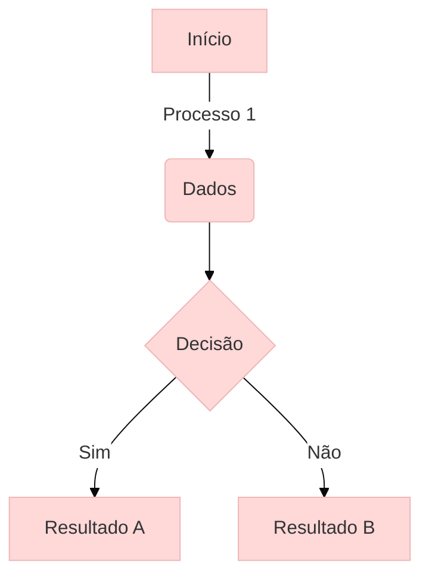

## 2. Formatação Avançada de Texto

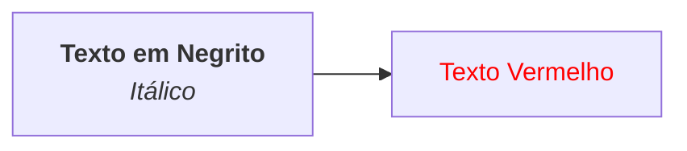

## 3. Alinhamento e Layout

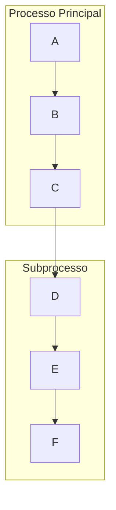

## 4. Diagramas de Sequência Detalhados

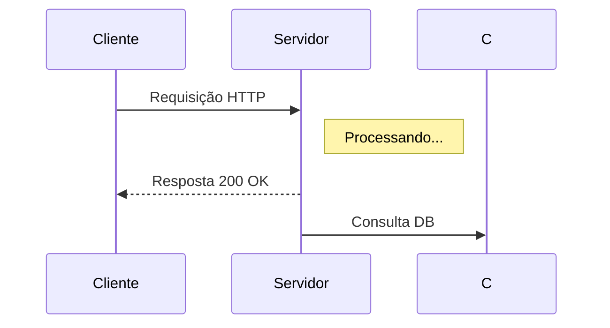

## 5. Personalização de Formas

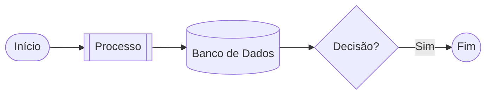

## 6. Uso de Classes CSS

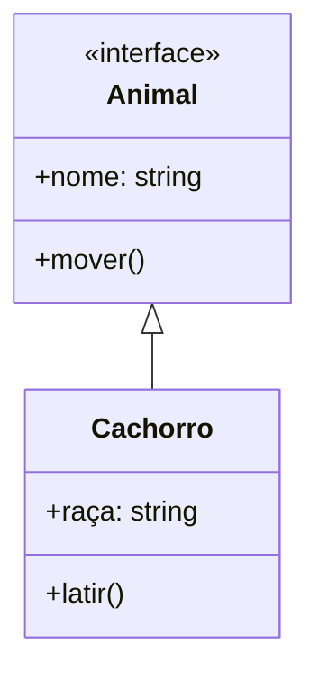


# Diagramas Mermaid Avançados: Técnicas Profissionais


## 1. Diagramas de Arquitetura Complexos

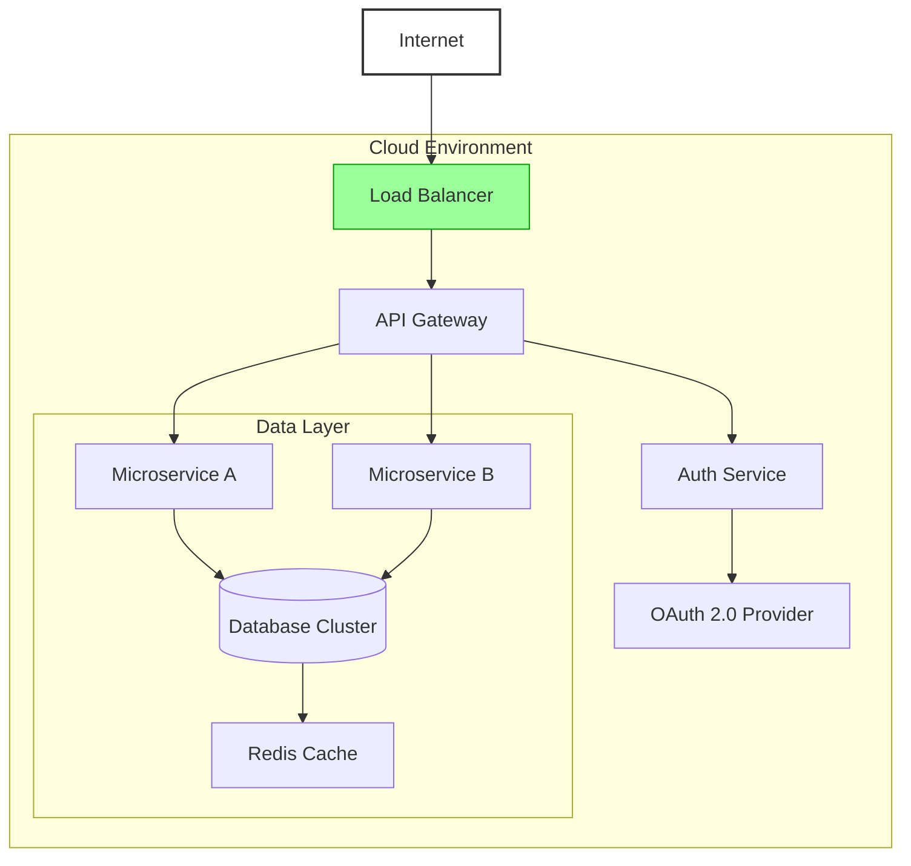

## 2. Diagramas de Sequência Detalhados com Loops e Alternativas

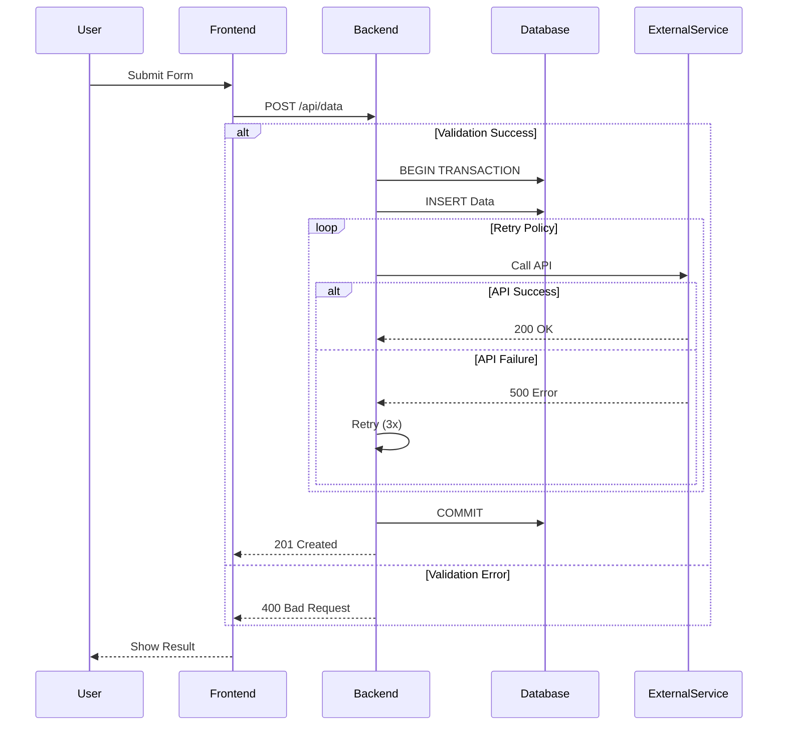

## 3. Diagramas de Estado Complexos

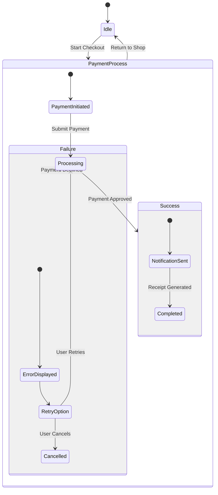


## 5. Fluxo de CI/CD com Subgraphs Aninhados

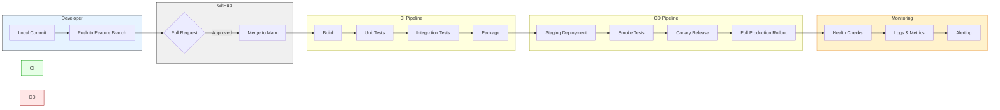

## 6. Personalização Extrema com CSS Direto

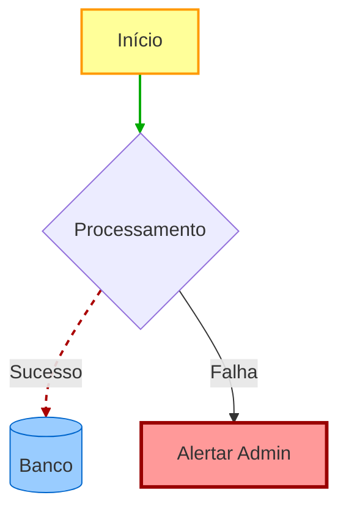


## 1. Diagrama de Rede Kubernetes (AKS/EKS)

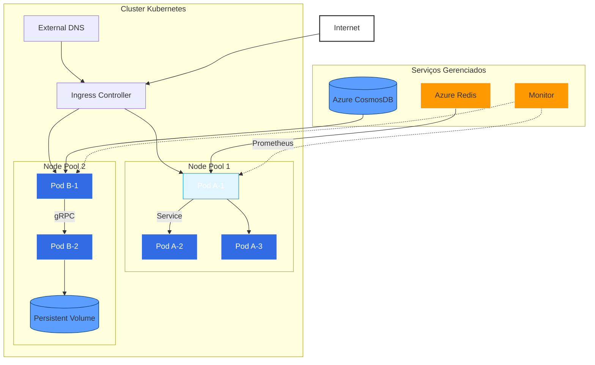

## 3. Fluxo de Machine Learning (MLOps)

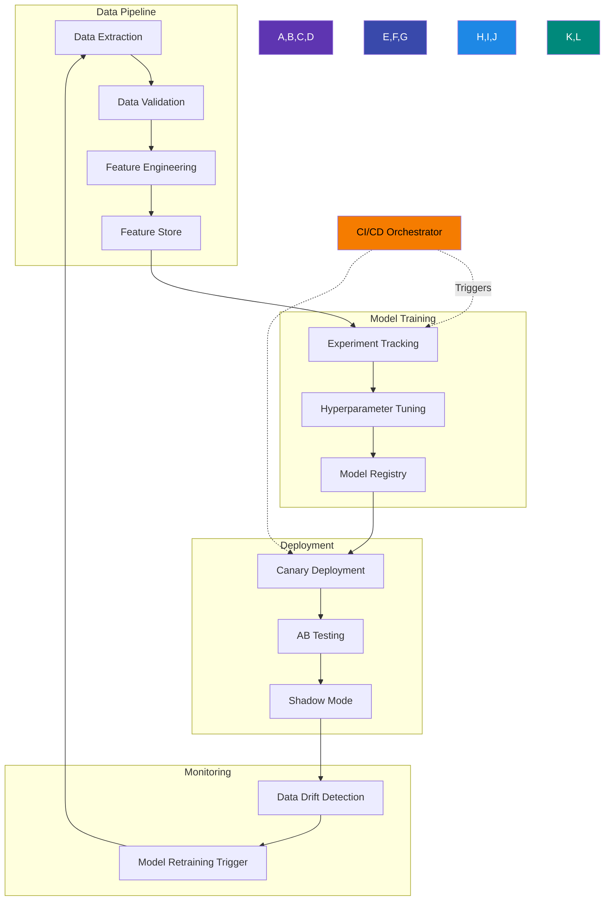

## 4. Sistema Distribuído com Mensageria (Event-Driven)

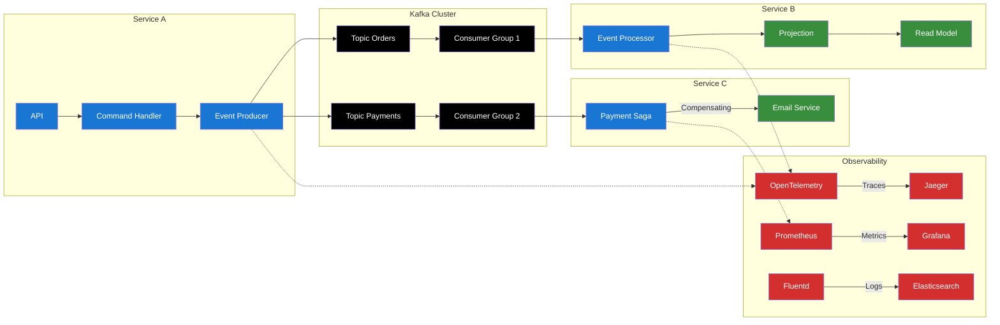

## Técnicas Avançadas Utilizadas:

1. **Hierarquia Visual** - Subgraphs aninhados para representar componentes lógicos
2. **Semântica de Cores** - Esquema de cores consistente por tipo de componente
3. **Estilos Personalizados** - classDef para padronização visual
4. **Tipos de Conexão** - Setas sólidas para fluxo principal, tracejadas para secundárias
5. **Notação Especial** - Ícones e símbolos para diferentes tipos de serviços
6. **Cross-Linking** - Conexões entre subgrafos distintos


1. **Formas mais elaboradas** (não apenas retângulos básicos)  
2. **Ícones e elementos visuais ricos**  
3. **Hierarquia visual clara**  
4. **Detalhes realistas**  

---


### 🛠️ **Soluções para o erro:**

1. **Remova elementos complexos** (ícones externos, HTML):
   ```mermaid
   graph TD
       subgraph "Cluster Kubernetes"
           A[Pod Frontend] --> B[Pod Backend]
           B --> C[(Redis)]
           D[Ingress] --> A
       end
       E[Internet] --> D
   ```

2. **Use a sintaxe Mermaid pura** (sem HTML/CSS externo):
   ```mermaid
   flowchart TB
       subgraph DataPipeline
           A[Data Sources] --> B[Preprocessing]
           B --> C[Feature Store]
       end
       C --> D[Model Training]
   ```


---

### ✨ **Versão Funcional do Kubernetes Diagram** (sem ícones):
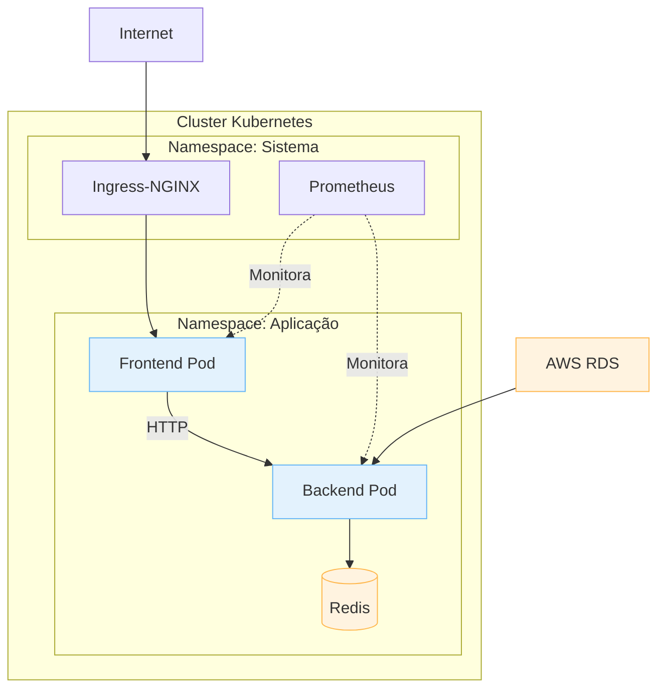


# Diagrama Avançado: Sistema de Detecção de Comportamento Anômalo (SentinelCore)

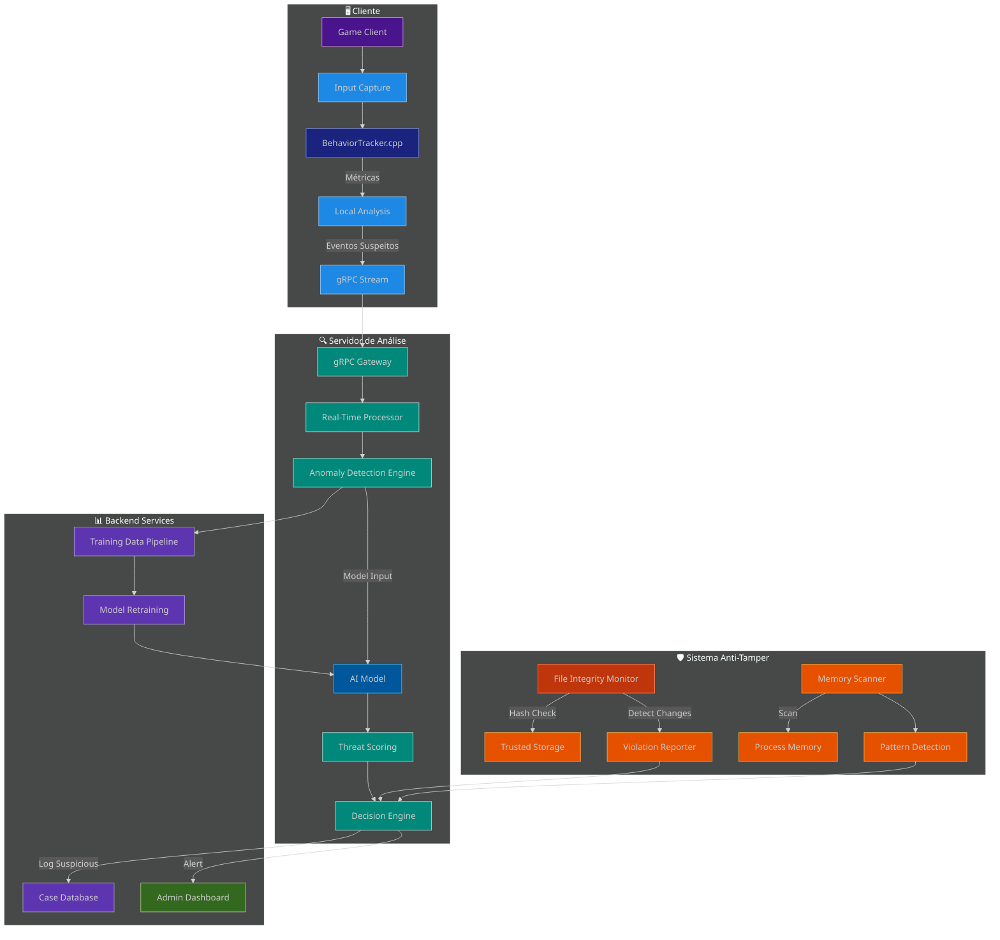

## Componentes Detalhados

### 1. Pipeline de Análise de Comportamento
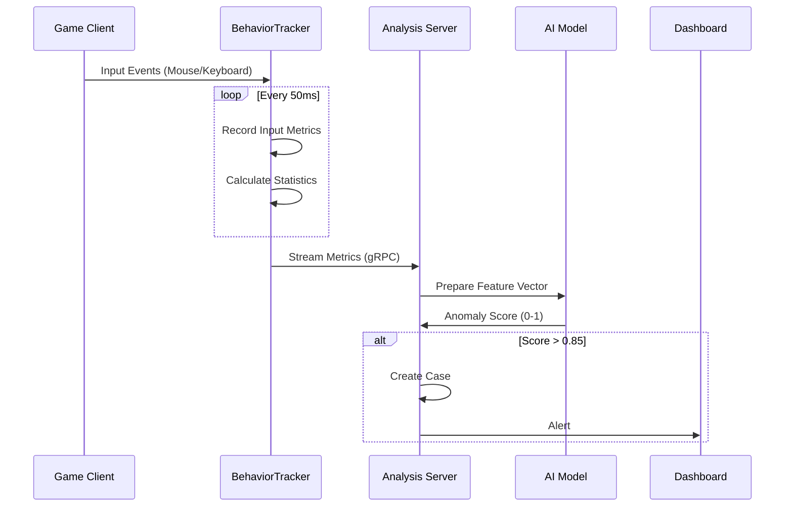

### 2. Arquitetura Anti-Tamper
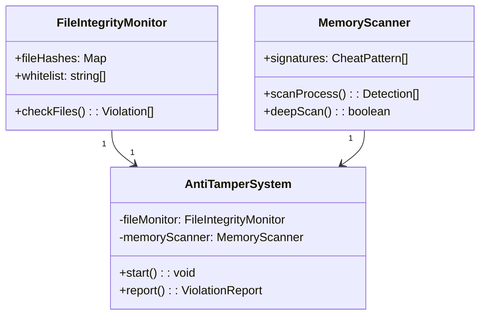

### 3. Dashboard de Anomalias (Exemplo)
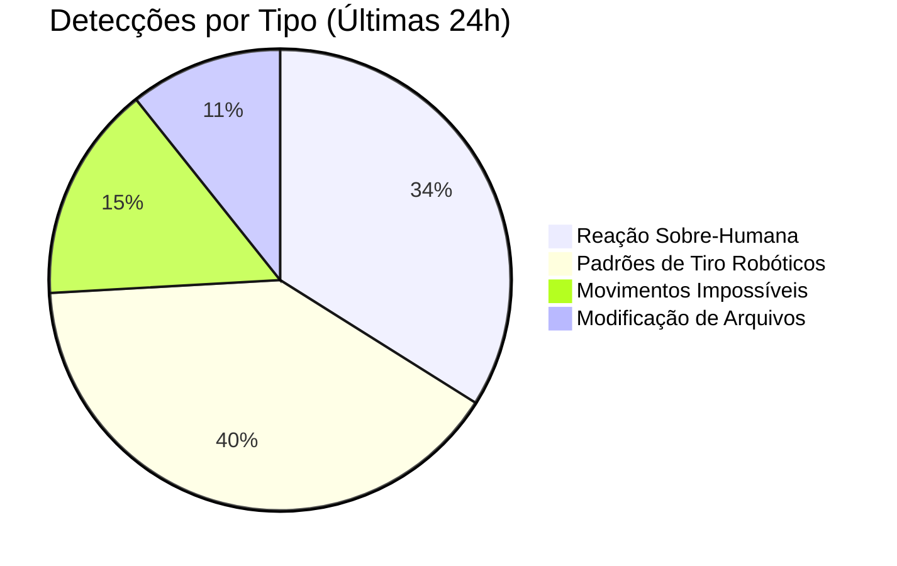

adilson oliveira
