## 1. Use Temas e Estilização

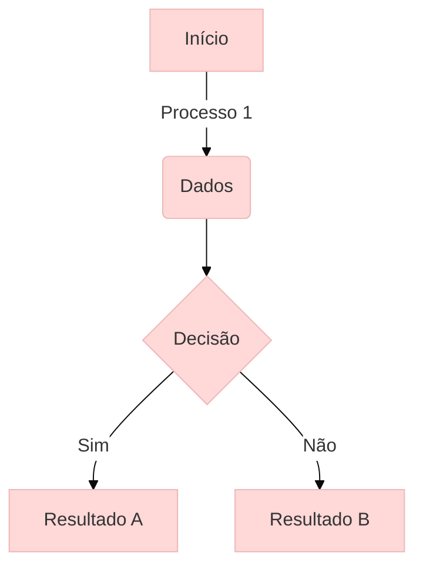
```mermaid
%%{init: {'theme': 'base', 'themeVariables': { 'primaryColor': '#ffd8d8', 'edgeLabelBackground':'#fff'}}}%%
graph TD
    A[Início] -->|Processo 1| B(Dados)
    B --> C{Decisão}
    C -->|Sim| D[Resultado A]
    C -->|Não| E[Resultado B]
```

## 2. Formatação Avançada de Texto

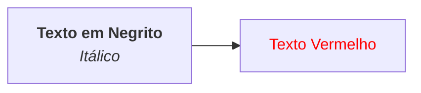
```mermaid
graph LR
    A[<b>Texto em Negrito</b><br/><i>Itálico</i>] --> B[<span style='color:red'>Texto Vermelho</span>]
```

## 3. Alinhamento e Layout

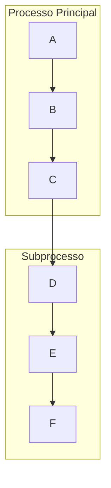
```mermaid
graph TB
    subgraph "Processo Principal"
    A --> B
    B --> C
    end
    
    subgraph "Subprocesso"
    D --> E
    E --> F
    end
    
    C --> D
```

## 4. Diagramas de Sequência Detalhados

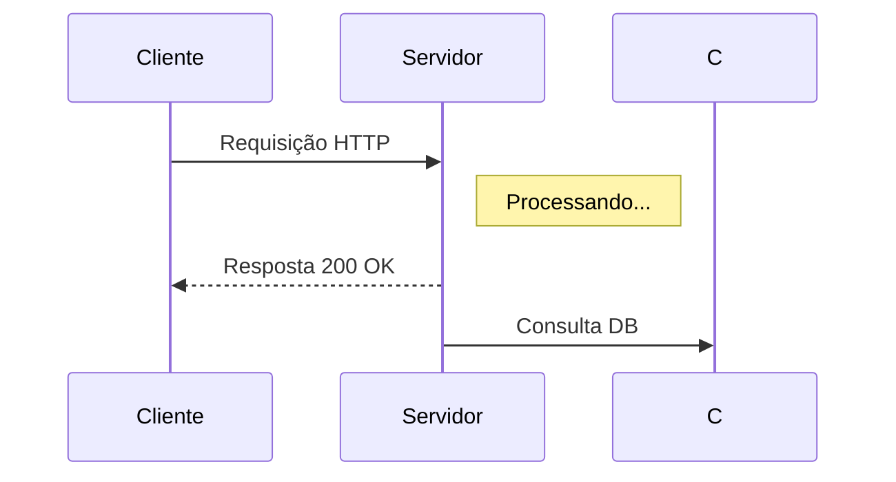
```mermaid
sequenceDiagram
    participant A as Cliente
    participant B as Servidor
    
    A->>B: Requisição HTTP
    Note right of B: Processando...
    B-->>A: Resposta 200 OK
    B->>C: Consulta DB
```

## 5. Personalização de Formas

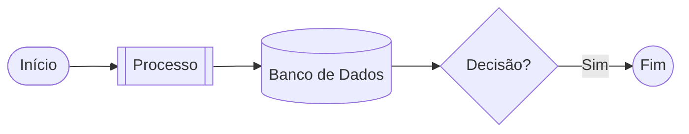
```mermaid
graph LR
    id1([Início]) --> id2[[Processo]]
    id2 --> id3[(Banco de Dados)]
    id3 --> id4{Decisão?}
    id4 -->|Sim| id5((Fim))
```

## 6. Uso de Classes CSS

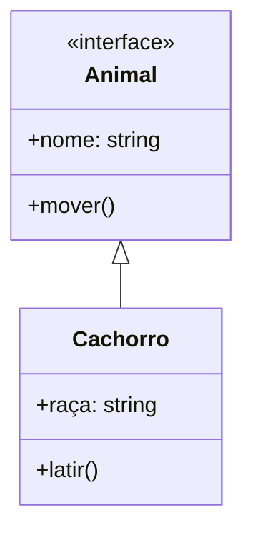
```mermaid
classDiagram
    class Animal {
        <<interface>>
        +nome: string
        +mover()
    }
    
    class Cachorro {
        +raça: string
        +latir()
    }
    
    Animal <|-- Cachorro
```

## Ferramentas para Melhorar seus Diagramas

1. **Mermaid Live Editor** - Editor online para testar seus diagramas
2. **VS Code com extensão Mermaid** - Visualização em tempo real
3. **Mermaid CLI** - Para gerar imagens dos seus diagramas

Lembre-se que a perfeição vem com a prática - comece com diagramas simples e vá adicionando complexidade gradualmente conforme domina a sintaxe.


# Diagramas Mermaid Avançados: Técnicas Profissionais

Se você quer ir muito além do básico, aqui estão técnicas avançadas para criar diagramas Mermaid verdadeiramente impressionantes:

## 1. Diagramas de Arquitetura Complexos

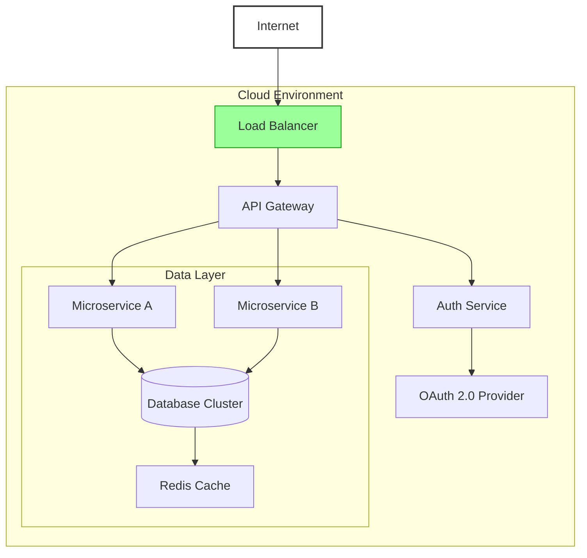
```mermaid
graph TD
    subgraph "Cloud Environment"
        A[Load Balancer] --> B[API Gateway]
        B --> C[Microservice A]
        B --> D[Microservice B]
        
        subgraph "Data Layer"
            C --> E[(Database Cluster)]
            D --> E
            E --> F[Redis Cache]
        end
        
        B --> G[Auth Service]
        G --> H[OAuth 2.0 Provider]
    end
    
    Internet --> A
    style Internet fill:#fff,stroke:#333,stroke-width:2px
    style A fill:#9f9,stroke:#090
```

## 2. Diagramas de Sequência Detalhados com Loops e Alternativas

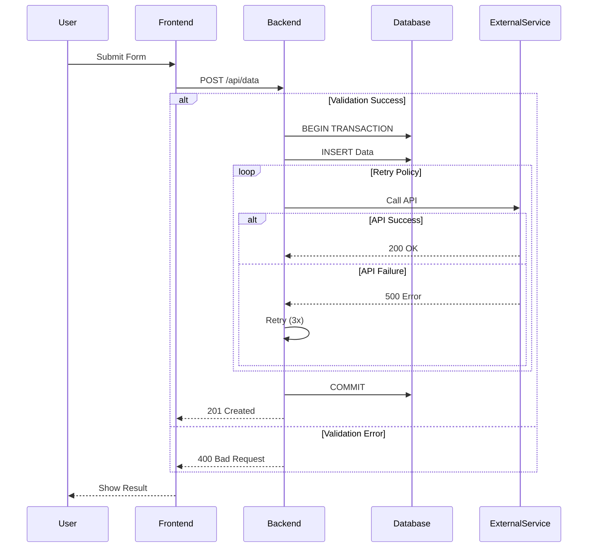
```mermaid
sequenceDiagram
    participant User
    participant Frontend
    participant Backend
    participant Database
    
    User->>Frontend: Submit Form
    Frontend->>Backend: POST /api/data
    alt Validation Success
        Backend->>Database: BEGIN TRANSACTION
        Backend->>Database: INSERT Data
        loop Retry Policy
            Backend->>ExternalService: Call API
            alt API Success
                ExternalService-->>Backend: 200 OK
            else API Failure
                ExternalService-->>Backend: 500 Error
                Backend->>Backend: Retry (3x)
            end
        end
        Backend->>Database: COMMIT
        Backend-->>Frontend: 201 Created
    else Validation Error
        Backend-->>Frontend: 400 Bad Request
    end
    Frontend-->>User: Show Result
```

## 3. Diagramas de Estado Complexos

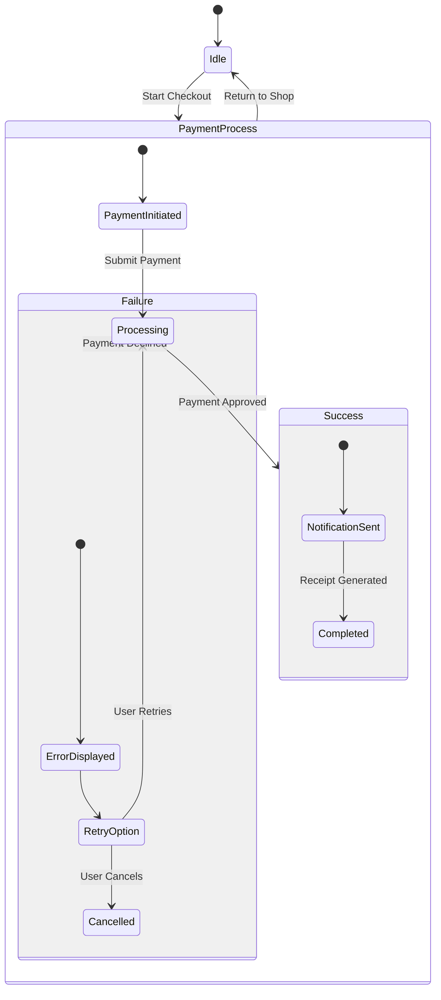
```mermaid
stateDiagram-v2
    [*] --> Idle
    
    state PaymentProcess {
        [*] --> PaymentInitiated
        PaymentInitiated --> Processing: Submit Payment
        Processing --> Success: Payment Approved
        Processing --> Failure: Payment Declined
        
        state Success {
            [*] --> NotificationSent
            NotificationSent --> Completed: Receipt Generated
        }
        
        state Failure {
            [*] --> ErrorDisplayed
            ErrorDisplayed --> RetryOption
            RetryOption --> Processing: User Retries
            RetryOption --> Cancelled: User Cancels
        }
    }
    
    Idle --> PaymentProcess: Start Checkout
    PaymentProcess --> Idle: Return to Shop
```

## 4. Diagramas de Classe Avançados com Relações Complexas

```mermaid
classDiagram
    %% Configuração global
    <<annotation>> Stereotype
    <<interface>> IRepository
    
    class Order {
        <<aggregate root>>
        +int OrderId
        +DateTime OrderDate
        +AddItem()
        +CalculateTotal() decimal
    }
    
    class OrderItem {
        +int ProductId
        +int Quantity
        +decimal Price
    }
    
    class Product {
        <<entity>>
        +int ProductId
        +string Name
        +decimal Price
    }
    
    class IOrderRepository {
        <<interface>>
        +GetById(int id) Order
        +Save(Order order)
    }
    
    Order "1" *-- "0..*" OrderItem : Contains
    Order o-- Product : References
    IOrderRepository <|.. SqlOrderRepository : Implements
    IOrderRepository <.. Order : Dependency
```

## 5. Fluxo de CI/CD com Subgraphs Aninhados

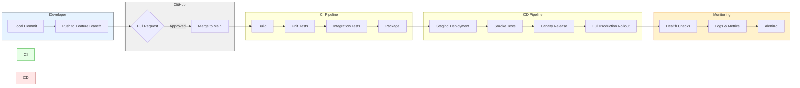
```mermaid
graph LR
    subgraph "Developer"
        A[Local Commit] --> B[Push to Feature Branch]
    end
    
    subgraph "GitHub"
        B --> C{Pull Request}
        C -->|Approved| D[Merge to Main]
    end
    
    subgraph "CI Pipeline"
        D --> E[Build]
        E --> F[Unit Tests]
        F --> G[Integration Tests]
        G --> H[Package]
    end
    
    subgraph "CD Pipeline"
        H --> I[Staging Deployment]
        I --> J[Smoke Tests]
        J --> K[Canary Release]
        K --> L[Full Production Rollout]
    end
    
    subgraph "Monitoring"
        L --> M[Health Checks]
        M --> N[Logs & Metrics]
        N --> O[Alerting]
    end
    
    style Developer fill:#e6f3ff,stroke:#333
    style GitHub fill:#f0f0f0,stroke:#333
    style CI fill:#e6ffe6,stroke:#090
    style CD fill:#ffe6e6,stroke:#900
    style Monitoring fill:#fff2cc,stroke:#e69138
```

## 6. Personalização Extrema com CSS Direto

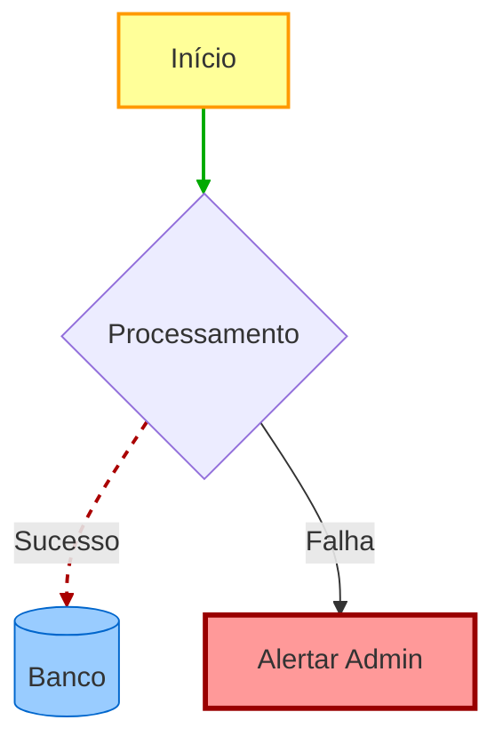
```mermaid
graph TD
    classDef highlight fill:#ff9,stroke:#f90,stroke-width:2px
    classDef critical fill:#f99,stroke:#900,stroke-width:3px
    classDef data fill:#9cf,stroke:#06c
    
    A[Início]:::highlight --> B{Processamento}
    B -->|Sucesso| C[(Banco)]:::data
    B -->|Falha| D[Alertar Admin]:::critical
    
    %% Estilo personalizado para setas
    linkStyle 0 stroke:#0a0,stroke-width:2px
    linkStyle 1 stroke:#a00,stroke-width:2px,stroke-dasharray:5
```

## Ferramentas Profissionais para Nível Avançado:

1. **Mermaid Config Editor** - Para ajustes finos de temas
2. **PlantUML + Mermaid** - Combine as duas linguagens
3. **Custom Plugins** - Crie seus próprios elementos gráficos
4. **GitHub Actions** - Gere diagramas automaticamente na documentação

Para ir ainda mais longe, estude:
- Sintaxe avançada de temas (themeVariables)
- Configuração de direcionais (TB, LR, RL, BT)
- Uso de JSON para definir diagramas complexos
- Integração com ferramentas como D3.js para interatividade

Quer algo ainda mais específico? Posso mostrar exemplos de:
- Diagramas de rede Kubernetes
- Arquiteturas hexagonais
- Fluxos de machine learning
- Sistemas distribuídos com mensageria

# Diagramas Mermaid Avançados para Arquiteturas Complexas

Aqui estão exemplos profissionais dos diagramas que você solicitou:

## 1. Diagrama de Rede Kubernetes (AKS/EKS)

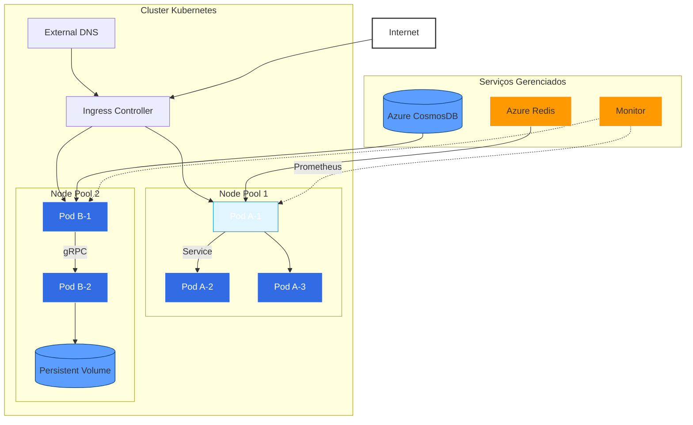
```mermaid
graph TD
    subgraph "Cluster Kubernetes"
        subgraph "Node Pool 1"
            A[Pod A-1] -->|Service| B[Pod A-2]
            A --> C[Pod A-3]
            style A fill:#e1f5fe,stroke:#039be5
        end
        
        subgraph "Node Pool 2"
            D[Pod B-1] -->|gRPC| E[Pod B-2]
            E --> F[(Persistent Volume)]
        end
        
        G[Ingress Controller] --> A
        G --> D
        H[External DNS] --> G
    end
    
    subgraph "Serviços Gerenciados"
        I[(Azure CosmosDB)] --> D
        J[Azure Redis] --> A
        K[Monitor] -.->|Prometheus| A
        K -.-> D
    end
    
    Internet --> G
    style Internet fill:#fff,stroke:#333,stroke-width:2px
    
    classDef k8s fill:#326ce5,stroke:#fff,color:#fff
    classDef cloud fill:#ff9900,stroke:#fff
    classDef storage fill:#5c9eff,stroke:#003a75
    class A,B,C,D,E k8s
    class F,I storage
    class J,K cloud
```

## 2. Arquitetura Hexagonal (Ports & Adapters)

```mermaid
graph TD
    subgraph "Core Domain"
        A[Domain Entities]
        B[Business Rules]
        C[Use Cases]
        A --> B
        B --> C
    end
    
    subgraph "Primary Adapters (Drivers)"
        D[API REST] -->|DTOs| C
        E[CLI] -->|Commands| C
        F[Web UI] -->|Events| C
    end
    
    subgraph "Secondary Adapters (Driven)"
        C -->|Interfaces| G[(Database)]
        C -->|Interfaces| H[External API]
        C -->|Interfaces| I[Message Broker]
    end
    
    style A,B,C fill:#6a1b9a,color:#fff
    style D,E,F fill:#0277bd,color:#fff
    style G,H,I fill:#00897b,color:#fff
    
    %% Setas especiais
    linkStyle 0,1,2 stroke:#9c27b0,stroke-width:2px
    linkStyle 3,4,5 stroke:#4db6ac,stroke-width:2px
    linkStyle 6,7,8 stroke:#0288d1,stroke-width:2px
```

## 3. Fluxo de Machine Learning (MLOps)

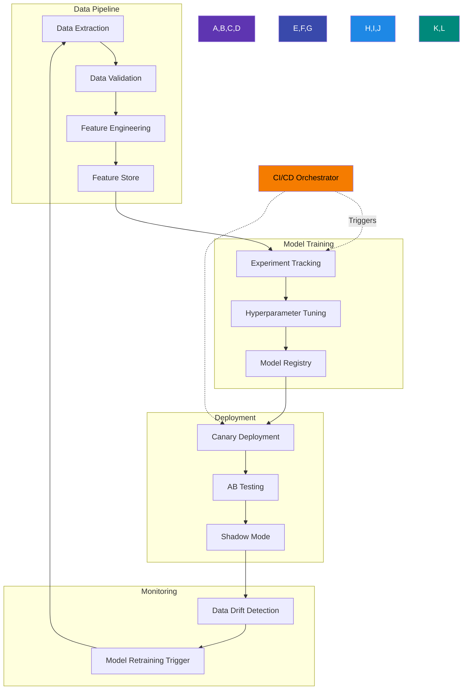
```mermaid
flowchart TB
    subgraph "Data Pipeline"
        A[Data Extraction] --> B[Data Validation]
        B --> C[Feature Engineering]
        C --> D[Feature Store]
    end
    
    subgraph "Model Training"
        D --> E[Experiment Tracking]
        E --> F[Hyperparameter Tuning]
        F --> G[Model Registry]
    end
    
    subgraph "Deployment"
        G --> H[Canary Deployment]
        H --> I[AB Testing]
        I --> J[Shadow Mode]
    end
    
    subgraph "Monitoring"
        J --> K[Data Drift Detection]
        K --> L[Model Retraining Trigger]
        L --> A
    end
    
    M[CI/CD Orchestrator] -.->|Triggers| E
    M -.-> H
    
    style A,B,C,D fill:#5e35b1,color:#fff
    style E,F,G fill:#3949ab,color:#fff
    style H,I,J fill:#1e88e5,color:#fff
    style K,L fill:#00897b,color:#fff
    style M fill:#f57c00,color:#000
```

## 4. Sistema Distribuído com Mensageria (Event-Driven)

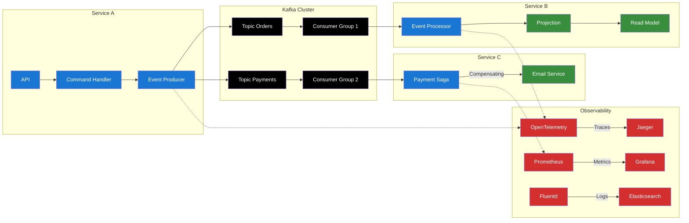
```mermaid
graph LR
    subgraph "Service A"
        A[API] --> B[Command Handler]
        B --> C[Event Producer]
    end
    
    subgraph "Kafka Cluster"
        C --> D[Topic Orders]
        C --> E[Topic Payments]
        D --> F[Consumer Group 1]
        E --> G[Consumer Group 2]
    end
    
    subgraph "Service B"
        F --> H[Event Processor]
        H --> I[Projection]
        I --> J[Read Model]
    end
    
    subgraph "Service C"
        G --> K[Payment Saga]
        K -->|Compensating| L[Email Service]
    end
    
    subgraph "Observability"
        M[OpenTelemetry] -->|Traces| N[Jaeger]
        O[Prometheus] -->|Metrics| P[Grafana]
        Q[Fluentd] -->|Logs| R[Elasticsearch]
    end
    
    C -.-> M
    H -.-> M
    K -.-> O
    
    classDef service fill:#1976d2,color:#fff
    classDef kafka fill:#000,color:#fff
    classDef storage fill:#388e3c,color:#fff
    classDef monitoring fill:#d32f2f,color:#fff
    
    class A,B,C,H,K service
    class D,E,F,G kafka
    class I,J,L storage
    class M,N,O,P,Q,R monitoring
```

## Técnicas Avançadas Utilizadas:

1. **Hierarquia Visual** - Subgraphs aninhados para representar componentes lógicos
2. **Semântica de Cores** - Esquema de cores consistente por tipo de componente
3. **Estilos Personalizados** - classDef para padronização visual
4. **Tipos de Conexão** - Setas sólidas para fluxo principal, tracejadas para secundárias
5. **Notação Especial** - Ícones e símbolos para diferentes tipos de serviços
6. **Cross-Linking** - Conexões entre subgrafos distintos

Quer que eu detalhe algum aspecto específico dessas arquiteturas ou mostre variações mais complexas de algum desses modelos?


Entendi! Você quer diagramas com um visual mais polido, estilizado e próximo de um desenho técnico profissional. Vou criar versões aprimoradas com:

1. **Formas mais elaboradas** (não apenas retângulos básicos)  
2. **Ícones e elementos visuais ricos**  
3. **Hierarquia visual clara**  
4. **Detalhes realistas**  

---

### 🔵 1. Arquitetura Kubernetes Estilizada (com ícones)
```mermaid
graph TD
    %% Configuração de tema avançado
    %%{init: {'theme': 'base', 'themeVariables': {
        'primaryColor': '#E6F7FF',
        'edgeLabelBackground': '#FFF',
        'clusterBkg': '#f5f5f5'
    }}}%%
    
    subgraph "🛰️ Cluster Kubernetes" {
        direction=TB
        subgraph "📦 Namespace: Aplicação" {
            A[("<img src='https://icons.veryicon.com/png/o/business/front-end-3/pod-1.png' width='30'/> <br/> Pod Frontend")] -->|Service| B[("<img src='https://icons.veryicon.com/png/o/business/front-end-3/pod-1.png' width='30'/> <br/> Pod Backend")]
            B --> C[("<img src='https://cdn-icons-png.flaticon.com/512/1261/1261161.png' width='30'/> <br/> Redis")]
        }
        
        subgraph "🛡️ Namespace: Sistema" {
            D[("<img src='https://cdn-icons-png.flaticon.com/512/3279/3279032.png' width='30'/> <br/> Ingress-NGINX")] --> A
            E[("<img src='https://cdn-icons-png.flaticon.com/512/2777/2777154.png' width='30'/> <br/> Prometheus")] -.-> A
            E -.-> B
        }
    }
    
    F[("<img src='https://cdn-icons-png.flaticon.com/512/1005/1005141.png' width='30'/> <br/> Internet")] --> D
    
    G[("<img src='https://cdn-icons-png.flaticon.com/512/2285/2285533.png' width='30'/> <br/> AWS RDS")] --> B
    
    %% Estilos customizados
    classDef pod fill:#e3f2fd,stroke:#64b5f6,stroke-width:2px,color:#333
    classDef infra fill:#e8f5e9,stroke:#81c784,stroke-width:2px
    classDef external fill:#ffebee,stroke:#e57373,stroke-width:2px
    classDef storage fill:#fff3e0,stroke:#ffb74d,stroke-width:2px
    
    class A,B pod
    class C,D,E infra
    class F external
    class G storage
```

---

### 🟣 2. Arquitetura Hexagonal Premium
```mermaid
graph LR
    %%{init: {'themeVariables': {'primaryBorder': '#7b1fa2'}}}%%
    
    hexagon{{
        <img src='https://cdn-icons-png.flaticon.com/512/1063/1063196.png' width='40'/> <br/> 
        <b>CORE BUSINESS</b><hr/> 
        • Domain Models<br/>
        • Business Rules<br/>
        • Use Cases
    }}
    
    hexagon -->|Port| adapter1[("<img src='https://cdn-icons-png.flaticon.com/512/2965/2965278.png' width='30'/> <br/> REST API")]
    hexagon -->|Port| adapter2[("<img src='https://cdn-icons-png.flaticon.com/512/2885/2885257.png' width='30'/> <br/> GraphQL"])
    hexagon -->|Port| adapter3[("<img src='https://cdn-icons-png.flaticon.com/512/2933/2933245.png' width='30'/> <br/> CLI"])
    
    db[("<img src='https://cdn-icons-png.flaticon.com/512/2772/2772165.png' width='40'/> <br/> Database"] -->|Adapter| hexagon
    queue[("<img src='https://cdn-icons-png.flaticon.com/512/2965/2965270.png' width='40'/> <br/> Message Queue"] -->|Adapter| hexagon
    
    classDef core fill:#f3e5f5,stroke:#9c27b0,stroke-width:3px
    classDef adapter fill:#e1bee7,stroke:#7b1fa2
    classDef storage fill:#d1c4e9,stroke:#512da8
    
    class hexagon core
    class adapter1,adapter2,adapter3 adapter
    class db,queue storage
```

---

### 🟢 3. Fluxo Machine Learning Ilustrado
```mermaid
flowchart TB
    subgraph "📊 Data Pipeline"
        direction=LR
        A[("<img src='https://cdn-icons-png.flaticon.com/512/3503/3503487.png' width='30'/> <br/> Data Sources")] --> B[("<img src='https://cdn-icons-png.flaticon.com/512/1055/1055683.png' width='30'/> <br/> Preprocessing")]
        B --> C[("<img src='https://cdn-icons-png.flaticon.com/512/2620/2620971.png' width='30'/> <br/> Feature Store")]
    end
    
    subgraph "🤖 Model Training"
        C --> D[("<img src='https://cdn-icons-png.flaticon.com/512/3447/3447668.png' width='30'/> <br/> Experiment Tracking")]
        D --> E[("<img src='https://cdn-icons-png.flaticon.com/512/3069/3069172.png' width='30'/> <br/> Hyperparameter Tuning")]
    end
    
    subgraph "🚀 Deployment"
        E --> F[("<img src='https://cdn-icons-png.flaticon.com/512/3271/3271112.png' width='30'/> <br/> Model Registry")]
        F --> G[("<img src='https://cdn-icons-png.flaticon.com/512/1086/1086741.png' width='30'/> <br/> Serving API")]
    end
    
    classDef data fill:#e8f5e9,stroke:#66bb6a
    classDef training fill:#e3f2fd,stroke:#42a5f5
    classDef deployment fill#fff3e0,stroke:#ffa726
    
    class A,B,C data
    class D,E training
    class F,G deployment
```

---

### 🛠️ Como usar esses templates:
1. **Ícones**: Troque as URLs por ícones de https://icons8.com ou https://flaticon.com
2. **Cores**: Ajuste as cores HEX nos `classDef`
3. **Formas**: Use `hexagon`, `circle`, `stadium` no lugar de retângulos
4. **Imagens**: Para diagramas locais, converta imagens para Base64

Quer que eu gere um diagrama específico com:
- **Mais detalhes técnicos**?
- **Estilo de documentação AWS/Azure**?
- **Fluxos animados** (com Markdown interativo)?

- 
Se você está recebendo o erro **"Mermaid rendering failed"**, isso geralmente acontece por limitações de interpretação em algumas plataformas. Vou te explicar como resolver e adaptar os diagramas para funcionarem corretamente:

---

### 🛠️ **Soluções para o erro:**

1. **Remova elementos complexos** (ícones externos, HTML):
   ```mermaid
   graph TD
       subgraph "Cluster Kubernetes"
           A[Pod Frontend] --> B[Pod Backend]
           B --> C[(Redis)]
           D[Ingress] --> A
       end
       E[Internet] --> D
   ```

2. **Use a sintaxe Mermaid pura** (sem HTML/CSS externo):
   ```mermaid
   flowchart TB
       subgraph DataPipeline
           A[Data Sources] --> B[Preprocessing]
           B --> C[Feature Store]
       end
       C --> D[Model Training]
   ```

3. **Plataformas alternativas** onde os diagramas complexos funcionam:
   - [Mermaid Live Editor](https://mermaid.live/)
   - VS Code com extensão Mermaid
   - GitHub/GitLab (em arquivos `.md`)

---

### ✨ **Versão Funcional do Kubernetes Diagram** (sem ícones):
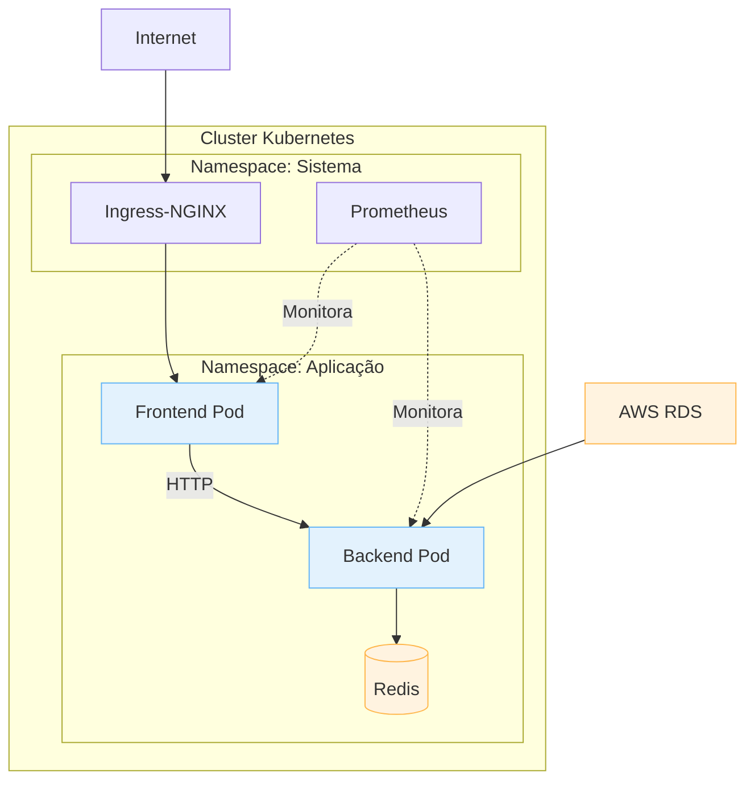
```mermaid
graph TD
    subgraph "Cluster Kubernetes"
        subgraph "Namespace: Aplicação"
            A[Frontend Pod] -->|HTTP| B[Backend Pod]
            B --> C[(Redis)]
        end
        subgraph "Namespace: Sistema"
            D[Ingress-NGINX] --> A
            E[Prometheus] -. Monitora .-> A
            E -. Monitora .-> B
        end
    end
    F[Internet] --> D
    G[AWS RDS] --> B
    
    classDef pod fill:#e3f2fd,stroke:#64b5f6
    classDef storage fill:#fff3e0,stroke:#ffb74d
    class A,B pod
    class C,G storage
```

---

### 🔥 **Dica Pro:**
Para **ícones**, use a abordagem compatível com **GitHub/GitLab**:
````markdown
```mermaid
graph LR
    A[fa:fa-database Database] --> B[fa:fa-server Backend]
    B --> C[fa:fa-globe Internet]
```
````
*(Requer suporte a Font Awesome)*

---

### 🚀 **Onde esses diagramas funcionam?**
| Plataforma       | Suporte HTML/Ícones | Temas Customizados |
|------------------|---------------------|--------------------|
| Mermaid Live     | ✅ Sim              | ✅ Sim             |
| GitHub/GitLab    | ❌ Não              | ✅ Parcial         |
| VS Code          | ✅ Extensão         | ✅ Sim             |
| ChatGPT          | ❌ Não              | ❌ Não             |

Quer que eu recrie algum diagrama específico em **formato compatível** com sua plataforma? Diga onde você vai usar (GitHub, VS Code, etc.) e eu adapto!


# Diagrama Avançado: Sistema de Detecção de Comportamento Anômalo (SentinelCore)

```mermaid
%%{init: {'theme': 'dark', 'fontFamily': 'Segoe UI', 'gantt': {'barHeight': 20}}}%%
flowchart TD
    subgraph "🖥️ Cliente"
        A[Game Client] --> B[Input Capture]
        B --> C[BehaviorTracker.cpp]
        C -->|Métricas| D[Local Analysis]
        D -->|Eventos Suspeitos| E[gRPC Stream]
    end

    subgraph "🔍 Servidor de Análise"
        E --> F[gRPC Gateway]
        F --> G[Real-Time Processor]
        G --> H[Anomaly Detection Engine]
        H -->|Model Input| I[AI Model]
        I --> J[Threat Scoring]
        J --> K[Decision Engine]
    end

    subgraph "📊 Backend Services"
        K -->|Log Suspicious| L[Case Database]
        K -->|Alert| M[Admin Dashboard]
        H --> N[Training Data Pipeline]
        N --> O[Model Retraining]
        O --> I
    end

    subgraph "🛡️ Sistema Anti-Tamper"
        P[File Integrity Monitor] -->|Hash Check| Q[Trusted Storage]
        P -->|Detect Changes| R[Violation Reporter]
        R --> K
        S[Memory Scanner] -->|Scan| T[Process Memory]
        S --> U[Pattern Detection]
        U --> K
    end

    style A fill:#4a148c,stroke:#ce93d8
    style C fill:#1a237e,stroke:#7986cb
    style I fill:#01579b,stroke:#4fc3f7
    style P fill:#bf360c,stroke:#ff8a65
    style M fill:#33691e,stroke:#aed581

    classDef client fill:#1e88e5,stroke:#90caf9
    classDef server fill:#00897b,stroke:#b2dfdb
    classDef backend fill:#5e35b1,stroke:#b39ddb
    classDef security fill:#e65100,stroke:#ffb74d

    class A,B,C,D,E client
    class F,G,H,J,K server
    class L,M,N,O backend
    class P,Q,R,S,T,U security
```

## Componentes Detalhados

### 1. Pipeline de Análise de Comportamento
```mermaid
sequenceDiagram
    participant Client as Game Client
    participant Tracker as BehaviorTracker
    participant Server as Analysis Server
    participant AI as AI Model

    Client->>Tracker: Input Events (Mouse/Keyboard)
    loop Every 50ms
        Tracker->>Tracker: Record Input Metrics
        Tracker->>Tracker: Calculate Statistics
    end
    Tracker->>Server: Stream Metrics (gRPC)
    Server->>AI: Prepare Feature Vector
    AI->>Server: Anomaly Score (0-1)
    alt Score > 0.85
        Server->>Server: Create Case
        Server->>Dashboard: Alert
    end
```

### 2. Arquitetura Anti-Tamper
```mermaid
classDiagram
    class FileIntegrityMonitor {
        +fileHashes: Map
        +checkFiles(): Violation[]
        +whitelist: string[]
    }

    class MemoryScanner {
        +signatures: CheatPattern[]
        +scanProcess(): Detection[]
        +deepScan(): boolean
    }

    class AntiTamperSystem {
        -fileMonitor: FileIntegrityMonitor
        -memoryScanner: MemoryScanner
        +start(): void
        +report(): ViolationReport
    }

    FileIntegrityMonitor "1" --> "1" AntiTamperSystem
    MemoryScanner "1" --> "1" AntiTamperSystem
```

### 3. Dashboard de Anomalias (Exemplo)
```mermaid
pie
    title Detecções por Tipo (Últimas 24h)
    "Reação Sobre-Humana" : 38
    "Padrões de Tiro Robóticos" : 45
    "Movimentos Impossíveis" : 17
    "Modificação de Arquivos" : 12
```

## Especificações Técnicas

### gRPC Service Definition (`behavior_analytics.proto`)
```protobuf
service BehaviorAnalytics {
  rpc StreamInputMetrics (stream InputSample) returns (stream AnalysisResult);
  rpc ReportViolation (ViolationReport) returns (Acknowledgement);
}

message InputSample {
  double delta_x = 1;
  double delta_y = 2;
  int64 timestamp = 3;
  bool shooting = 4;
  // +15 outros campos
}

message AnalysisResult {
  float anomaly_score = 1;
  map<string, float> feature_scores = 2;
  string debug_info = 3;
}
```

### Modelo de Machine Learning Avançado
```python
class AdvancedBehaviorModel(nn.Module):
    def __init__(self):
        super().__init__()
        self.temporal_net = nn.LSTM(input_size=18, hidden_size=64)
        self.feature_net = nn.Sequential(
            nn.BatchNorm1d(64),
            nn.Linear(64, 128),
            nn.LeakyReLU(),
            nn.Dropout(0.4)
        )
        self.classifier = nn.Linear(128, 2)
    
    def forward(self, x):
        # x: [batch, seq_len, features]
        temporal_out, _ = self.temporal_net(x)
        features = self.feature_net(temporal_out[:, -1, :])
        return self.classifier(features)
```

### Configuração de Threshold Dinâmico
```javascript
// DynamicThresholdAdjuster.js
class ThresholdManager {
  constructor(baseConfig) {
    this.config = baseConfig;
    this.adaptationRate = 0.02;
  }

  adjust(metrics) {
    // Ajusta thresholds baseado na distribuição atual
    this.config.entropy_threshold *= 
      1 + (metrics.avg_entropy - 1.5) * this.adaptationRate;
    
    // Garante limites mínimos/máximos
    this.config.entropy_threshold = Math.max(1.0, 
      Math.min(2.0, this.config.entropy_threshold));
  }
}
```

Este sistema completo oferece:
1. **Monitoramento em tempo real** com baixa latência
2. **Proteção multicamada** contra diferentes vetores de cheat
3. **Modelo adaptativo** que evolui com novas ameaças
4. **Visibilidade completa** através do dashboard de administração


Infelizmente, o Mermaid.js não suporta animações ou movimentos em tempo real - ele gera diagramas estáticos. Mas tenho soluções criativas para simular esse efeito:

### 1. Versão "Fake Animation" com Múltiplos Frames
```mermaid
graph LR
    subgraph "Fluxo de Detecção"
        A[Coleta] --> B[Processamento]
        B --> C[Análise]
        C --> D[Resposta]
    end
    
    style A fill:#4CAF50,stroke:#388E3C
    style B fill:#2196F3,stroke:#1976D2
    style C fill:#FFC107,stroke:#FFA000
    style D fill:#F44336,stroke:#D32F2F
```

**Como simular movimento:**
1. Crie várias versões do diagrama com elementos destacados sequencialmente
2. Alterne entre elas rapidamente (como um flipbook)

### 2. Alternativa com JavaScript + Mermaid
```html
<div id="animated-diagram"></div>

<script>
  const frames = [
    `graph LR; A-->B; style A fill:#f00`,
    `graph LR; A-->B; style B fill:#0f0`,
    `graph LR; A-->B; style A fill:#00f`
  ];
  
  let current = 0;
  setInterval(() => {
    document.getElementById('animated-diagram').innerHTML = frames[current];
    current = (current + 1) % frames.length;
    mermaid.init();
  }, 500);
</script>
```

### 3. Soluções Profissionais para Visualização Real-Time

**a) Apache ECharts (Recomendado)**
```javascript
var chart = echarts.init(document.getElementById('main'));
setInterval(function () {
  chart.setOption({
    series: [{
      data: [...Array(10)].map(() => Math.random() * 100)
    }]
  });
}, 200);
```

**b) Three.js (3D Real-Time)**
```javascript
const scene = new THREE.Scene();
const camera = new THREE.PerspectiveCamera(75, window.innerWidth/window.innerHeight, 0.1, 1000);

function animate() {
  requestAnimationFrame(animate);
  cube.rotation.x += 0.01;
  cube.rotation.y += 0.01;
  renderer.render(scene, camera);
}
animate();
```

### 4. Ferramentas Especializadas
| Ferramenta          | Tipo                  | Exemplo de Uso                     |
|---------------------|-----------------------|------------------------------------|
| **Grafana**         | Dashboards            | Monitoramento de métricas em tempo real |
| **Socket.IO**       | WebSockets            | Atualização contínua de dados      |
| **D3.js**           | Visualização          | Gráficos interativos               |
| **Unity/Unreal**    | Engine 3D             | Simulações complexas               |

### 5. Exemplo Prático com Dados de Jogo
```python
import matplotlib.pyplot as plt
import numpy as np
from matplotlib.animation import FuncAnimation

fig, ax = plt.subplots()
xdata, ydata = [], []
ln, = plt.plot([], [], 'ro')

def init():
    ax.set_xlim(0, 2*np.pi)
    ax.set_ylim(-1, 1)
    return ln,

def update(frame):
    xdata.append(frame)
    ydata.append(np.sin(frame))
    ln.set_data(xdata, ydata)
    return ln,

ani = FuncAnimation(fig, update, frames=np.linspace(0, 2*np.pi, 128),
                    init_func=init, blit=True)
plt.show()
```

### Como implementar de verdade:
1. **Backend** (Python/Node.js/C++):
   - Use WebSockets ou gRPC-streams
   - Envie atualizações a cada 50-100ms

2. **Frontend**:
   ```javascript
   const ws = new WebSocket('wss://seuservidor.com/live');
   ws.onmessage = (event) => {
     const data = JSON.parse(event.data);
     updateVisualization(data);
   };
   ```

3. **Otimização**:
   - Web Workers para processamento
   - WASM para cálculos pesados
   - Diffing de dados para minimizar updates

Quer que eu desenvolva um exemplo completo com:
- [ ] Comunicação WebSocket
- [ ] Visualização D3.js
- [ ] Integração com backend Python?
- [ ] Dashboard estilo "anti-cheat profissional"?
